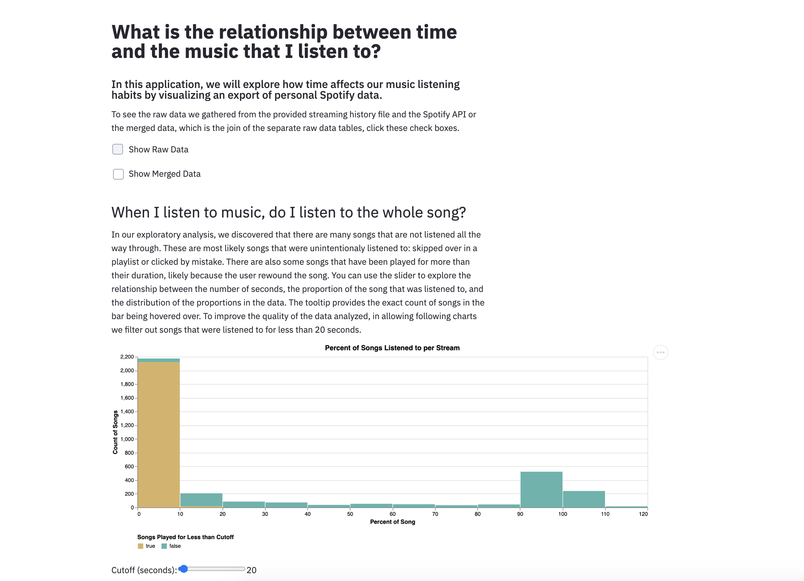

# Spotify Listening Habits

In this application, we explore the relationship between time, genre, and song characteristics for the music that a user of Spotify listens to. The data presented in this application is provided by [saraclay on Kaggle](https://www.kaggle.com/saraclay/my-spotify-streaming-history). We provide visualizations of the quality of the data, the listening habits over time, the relationship between genre listened to and the time of day that listening occurred, and the relationship between characteristics of songs, the genre they belong to, and the time of day that listening occurred.

## Project Goals
The primary question that we are exploring in this application is "what can we learn about the user’s listening habits through three aspects of their Spotify data: time when songs were listened to, music genre associated with the song's artist, and characteristics of individual songs?" This question was interesting to us because of the idea that such habits often go unrecognized and can be difficult to discover using only the Spotify application. The nearest feedback is from the 'rewind' playlists that Spotify produces, which use their own algorithms to select the user's favorite songs during a time period. The dimensions and measures that we examine are not readily available through the Spotify application - we collected the spotify genres and track features using tools presented through Spotify for Developers (https://developer.spotify.com/) and categorized the provided specific genres into broader genre groups for our analysis.

Some of the specific questions that we hope this application enables the user to explore are:
* How consistently does the user listen through spotify? Are there weekly, monthly, yearly patterns? When do they most often listen?
* What are the user's preferences as far as music genre? How much variety in genre does the data display? Do they like listening to certain genres at certain times of the day?
* What do the danceability, energy, etc. of songs show about the user's preferences? Are those characteristics associated with the genre being listened to or the time of day that listening occurs?

We provide the tools to explore our primary questions and these specific questions in our application by building up the dimensions being included. We start with an aspect of data quality that was unexpected and interesting: "When I listen to music, do I listen to the whole song?" We then present plots that analyze the time that listening occurs: "What are my weekly and daily listening patterns?" We enable the user to explore the relationship between time and genre through a streamgraph and violin plot: "How much time do I spend listening to each genre? How do my listening habits compare across genres?" And then we add in the music characteristics (called track features by Spotify) to allow exploration of the three aspects of time, genre, and music characteristic together: "What are the characteristics of the music that I listen to? Are there any patterns across genre and time of day?"

## Design
We chose simple univariate visualizations to introduce the data and see its distributions. For example, we displayed barcharts showing how many minutes and how many songs had been listened to each day.  This is just to get an idea of the density of the streaming dataset: Does the user listen to music everyday? What date range does this dataset cover? Does it have pre-pandemic and pandemic data?  Similarly, we show histograms of each music metric so that users can get a sense of how the metric is measures: Does this person listen to very danceable music? Are most of the songs lyrical or instrumental?

To achieve our goal, we used more complex plots with interactions to allow users to seek answers themselves. One of the first questions that we approached was "when does the user listen to music?" because its analysis only relied upon the data from the Spotify export process, not our own collected or computed data. When we did a brainstorm session where we sketched potential visualization encodings and plot types, we came up with several different methods of visualizing the yearly, weekly, and daily patterns. One of these visualizations was a time-block representation, showing the songs that the individual had listened to over the week, like when a calendar shows what events are scheduled for a particular week. In considering how the selection of data from the time plot would work, we realized that this plot provided excellent detail for one week, but wasn't easily expanded to multiple weeks and couldn't show broad trends. Instead, we used a heat map that showed density of listening in color with axes for time of day and day of the week. With this plot the user can make out broad trends and also choose to see the patterns of a particular week if they desire. We thought a lot about how to show seasonal patterns. Though the season (Winter, Spring, Summer, Fall) did not end up in any of our visualizations, having the plot of the time of year, which filters the hour vs. day plot, allows the user to also explore their listening habits across seasons of the year.

There were some strategies that we tried that did not show up in our final visualization. We did a correlation matrix where the music metrics were plotted against each other. Although this was interesting because it showed that, for example, speechiness and instrumentalness did not have exactly opposite distributions like one might think, it did not seem as useful as we thought it would be. We decided that because our music metric distributions closely matched the distributions of each metric that Spotify has shared in defining the track features that are measured, we could present the distributions separately. This allowed us to filter the distributions by specific data points being selected, which allows more understanding of patterns than the entire distribution itself. We also tried to make a packed bubble chart to rank the genres listened to, with packed bubbles inside each larger bubble representing the artists within the genre and how many of their songs had been listened to. We discovered that this chart type is not one that is easily done using Altair, and we received the guidance that a histogram is often better than a packed bar chart. We had made a histogram in our univariate analysis, but did not include it in the final product because it was not as interesting or interactive as the other visualizations.

We tried to make interaction that applied to multiple plots effectively, but in some cases it did not work out. In particular, we wanted to use the cut-off that the user specified in the first plot ("When I listen to music, do I listen to the whole song?") as the cut-off that would be used for all other plots. This way, if the user wanted to only look at the songs that were listened more than 90% of the way through, they would be able to specify that. However, we ran into issues trying to use Altair to do that. In particular, adding the slider selection to other plots put a new slider beneath those plots. At the very end of development, we recognized that it was possible to use a Streamlit's slider to allow the user to specify that cut-off, but doing so negatively impacted the interactivity because the Streamlit slider changing forced the program to rerun, whereas the Altair slider changing did not. We thought it was more impactful to have positive interactivity than to give this additional capability of specifying the filter for all charts to the user. However, we did use a Streamlit drop-down for the last plot ("What are the characteristics of the music that I listen to? Are there any patterns across genre and time of day?") because it allowed us to show the music metric's distribution with the scatter plot and add interactivity (previously these were univariate summaries that were separate from the scatter plot). We were unable to achieve this affect otherwise in Altair. We tried to use a range of interactive techniques: tooltip to show more specific data, interval selection in one plot (click and drag highlighting) to filter the data being presented in a second plot, and drop downs to allow a category to be chosen for more in-depth analysis. Since these interactions produce such different results, we did not have the situation where two interaction techniques were competing for being used.

## Development
Equal time was spent between Paulina and Peter.  Initially working separately, Peter and Paulina had two long zoom meetings to discuss the topic and the dataset.  Then working separately, Peter had time to work on converting the raw data into clean csv files.  It took about a half hour to get all the data from the Spotify API for each track and artist.  Paulina then worked on some initial visualizations of the data.  Then, through a series of zoom calls with peer programming, they completed the assignment together.

Cleaning the dataset at first took about 4 hours then doing some song genre imputation took about 4 hours.  The genres that were linked from the Spotify API were too specific ("norwegian indie rock", "post-teen pop") so we needed to create an algorithm to map these specific genres to broad genres.  We used keywords and voting to match each artist with a broad genre.  See `streamlit_app.py` for details.  The most difficult and time consuming process of the project was making specific plots in altair.  It was very easy to do certain things with altair, but trying to get something very specific to work could take almost hours.  The 6 zoom meetings were each about 3 hours long.  All in all, each partner spent about 25 hours on the project for a total of 50 people-hours.
